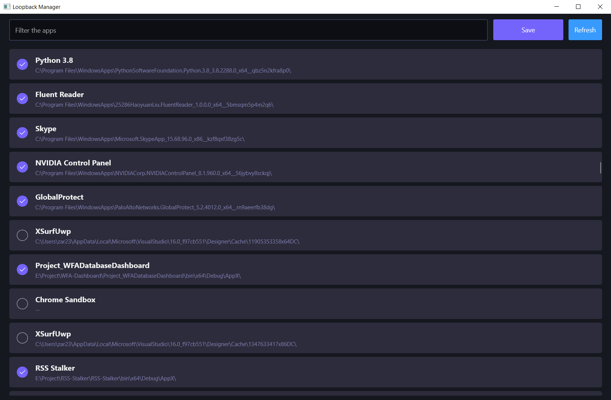

# LoopbackManager

**该项目废弃，迁移至 [LoopbackManager.Desktop](https://github.com/Richasy/LoopbackManager.Desktop)**

Local network loopback manager written by [Project Reunion](https://github.com/microsoft/ProjectReunion).

|||
|-|-|
|Tools|Visual Studio 2019 Preview|
|Min version|Windows 10 ver.1809|
|Target version|Windows 10 ver.2004|
|Reunion version|0.5.6|

